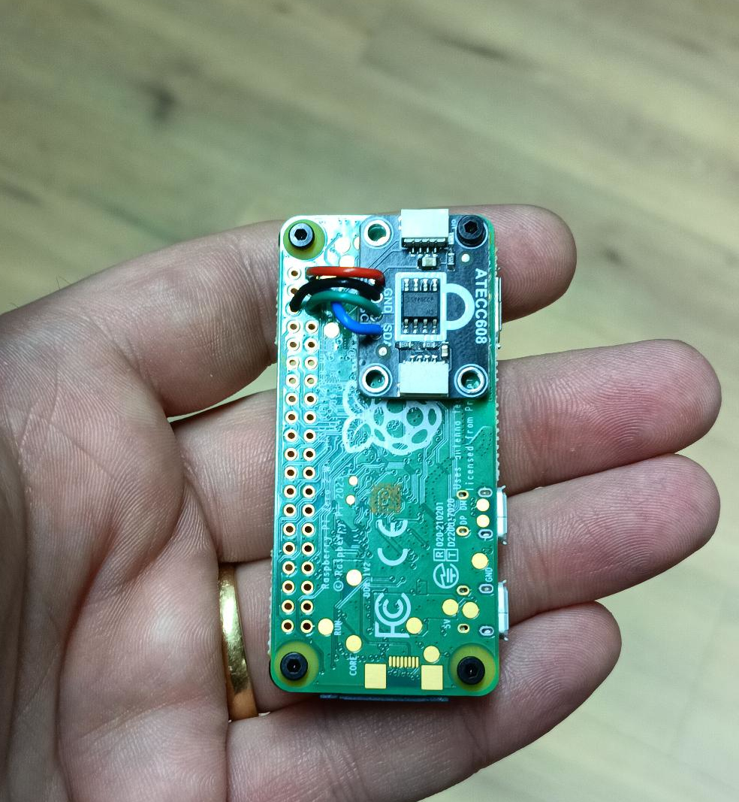

# Raspberry Pi Zero 2 W: USB Ethernet, I2C, and ATECC608A Setup

This guide provides minimal instructions for programmers to enable USB Ethernet gadget mode and I2C on a Raspberry Pi Zero 2 W, along with specific soldering instructions for connecting an ATECC608A secure element for true random number generation and hashing.

<!-- TOC -->
* [Raspberry Pi Zero 2 W: USB Ethernet, I2C, and ATECC608A Setup](#raspberry-pi-zero-2-w-usb-ethernet-i2c-and-atecc608a-setup)
  * [1. Hardware Connection (Soldering ATECC608A)](#1-hardware-connection-soldering-atecc608a)
  * [2. Prepare the SD Card `boot` Partition](#2-prepare-the-sd-card-boot-partition)
    * [Edit `config.txt`](#edit-configtxt)
    * [Edit `cmdline.txt`](#edit-cmdlinetxt)
    * [Create `ssh` File](#create-ssh-file)
    * [Make sure that the Serial Connection mounts the active TTY](#make-sure-that-the-serial-connection-mounts-the-active-tty)
  * [3. Boot the Raspberry Pi](#3-boot-the-raspberry-pi)
  * [4. Initial Access via USB Ethernet](#4-initial-access-via-usb-ethernet)
    * [SSH to the Pi using Serial](#ssh-to-the-pi-using-serial)
  * [5. Configure I2C and ATECC608A on the Pi](#5-configure-i2c-and-atecc608a-on-the-pi)
    * [Enabling I2C](#enabling-i2c)
    * [Install I2C Tools](#install-i2c-tools)
    * [Verify I2C and ATECC608A Detection](#verify-i2c-and-atecc608a-detection)
  * [6. Install Docker and pull images](#6-install-docker-and-pull-images)
<!-- TOC -->

## 1. Hardware Connection (Soldering ATECC608A)

**Safety First:** Ensure your Raspberry Pi Zero 2 W is **powered off and disconnected from all power sources** before performing any soldering.

You will be connecting the ATECC608A to the Raspberry Pi's GPIO header. Refer to a Raspberry Pi GPIO pinout diagram if you're unsure of pin locations.

| ATECC608A Pin | Raspberry Pi GPIO Pin | Pi Pin Number | Function    |
| :------------ | :-------------------- | :------------ | :---------- |
| VCC           | 3V3                   | Pin 1         | Power       |
| SDA           | GPIO 2 (SDA)          | Pin 3         | I2C Data    |
| SCL           | GPIO 3 (SCL)          | Pin 5         | I2C Clock   |
| GND           | Ground                | Pin 6         | Ground      |




**Soldering Steps:**

1.  **Prepare Wires:** Cut four small lengths of wire. Strip a small amount of insulation (a few millimeters) from both ends of each wire.
2.  **Tin Wires:** Lightly tin the stripped ends of the wires with solder. This makes soldering easier and creates more reliable connections.
3.  **Solder to ATECC608A:** Carefully solder one end of each wire to the corresponding VCC, SDA, SCL, and GND pads on your ATECC608A module or chip breakout board.
4.  **Solder to Raspberry Pi:** Solder the other end of each wire to the designated pins on the Raspberry Pi Zero 2 W's GPIO header as per the table above.
    * **Pin 1:** 3V3 (closest to the corner with the square pad)
    * **Pin 3:** GPIO 2 (I2C SDA)
    * **Pin 5:** GPIO 3 (I2C SCL)
    * **Pin 6:** Ground
5.  **Inspect:** Thoroughly double-check all your connections. Ensure solder joints are shiny and conical, and critically, that there are no solder bridges (shorts) between adjacent pins.

## 2. Prepare the SD Card `boot` Partition

Access the `boot` partition of your flashed SD card on your computer.

### Edit `config.txt`

Replace with the following lines to `boot/config.txt`:

```
# For more options and information see
# http://rptl.io/configtxt
# Some settings may impact device functionality. See link above for details

# Uncomment some or all of these to enable the optional hardware interfaces
dtparam=i2c_arm=on
#dtparam=i2s=on
#dtparam=spi=on

# Enable audio (loads snd_bcm2835)
dtparam=audio=on

# Additional overlays and parameters are documented
# /boot/firmware/overlays/README

# Automatically load overlays for detected cameras
camera_auto_detect=1

# Automatically load overlays for detected DSI displays
display_auto_detect=1

# Automatically load initramfs files, if found
auto_initramfs=1

# Enable DRM VC4 V3D driver
dtoverlay=vc4-kms-v3d
max_framebuffers=2

# Don't have the firmware create an initial video= setting in cmdline.txt.
# Use the kernel's default instead.
disable_fw_kms_setup=1

# Run in 64-bit mode
arm_64bit=1

# Disable compensation for displays with overscan
disable_overscan=1

# Run as fast as firmware / board allows
arm_boost=1

[all]
dtparam=i2c_arm_baudrate=100000
dtoverlay=dwc2,dr_mode=peripheral
```

### Edit `cmdline.txt`

**Append** `modules-load=dwc2,g_serial` to the **existing single line** in `boot/cmdline.txt`. Ensure there are no line breaks and that it is space-separated from other arguments.

For example, your `cmdline.txt` might look something like this (your `PARTUUID` will differ):

```
console=serial0,115200 console=tty1 root=PARTUUID=xxxxxxxx-xx rootfstype=ext4 fsck.repair=yes rootwait modules-load=dwc2,g_serial quiet init=/usr/lib/raspi-config/init_resize.sh
```

### Create `ssh` File

Create an empty file named `ssh` (with no file extension) in the `boot` directory. This enables SSH access on first boot. You can also activate it during flashing with the Raspberry Pi Imager

### Make sure that the Serial Connection mounts the active TTY

```bash
sudo mkdir -p /mnt/pi-root/etc/systemd/system/getty.target.wants
sudo ln -s /lib/systemd/system/serial-getty@.service /mnt/pi-root/etc/systemd/system/getty.target.wants/serial-getty@ttyGS0.service
```
in which the `/mnt/pi-root/` is dependent on your OS. 

## 3. Boot the Raspberry Pi

1.  Safely unmount the SD card from your computer.
2.  Insert the SD card into your Raspberry Pi Zero 2 W.
3.  Connect the **data/power micro-USB port** (the one closer to the edge, *not* the dedicated power port if present) of the Pi to your computer using a reliable USB **data** cable.

## 4. Initial Access via USB Ethernet

Your computer should now recognize the Raspberry Pi as a new USB Serial Connection

### SSH to the Pi using Serial

Once you've identified the Pi's IP address, you can establish an SSH connection:

```bash
screen /dev/ttyACM0 115200
```

Note that you can set your wifi using nmcli
```bash
nmcli device status
nmcli radio wifi on
nmcli device wifi connect "SSID" password "YOUR_PASSWORD_HERE"
```

The default password for the `pi` user is `raspberry`.

## 5. Configure I2C and ATECC608A on the Pi

After successfully SSHing into your Raspberry Pi, run the following commands:

### Enabling I2C

So the `dtparam=i2c_arm=on` on the config.txt should enable I2C, but it doesnt always. You can also enable it in `raspi-config`

```bash
sudo raspi-config
```
it should look something like this

```bash
Raspberry Pi Zero 2 W Rev 1.0, 512MB


┌─────────┤ Raspberry Pi Software Configuration Tool (raspi-config) ├──────────┐
│                                                                              │
│       1 System Options       Configure system settings                       │
│       2 Display Options      Configure display settings                      │
│       3 Interface Options    Configure connections to peripherals            │
│       4 Performance Options  Configure performance settings                  │
│       5 Localisation Options Configure language and regional settings        │
│       6 Advanced Options     Configure advanced settings                     │
│       8 Update               Update this tool to the latest version          │
│       9 About raspi-config   Information about this configuration tool       │
│                                                                              │
│                                                                              │
│                                                                              │
│                                                                              │
│                                                                              │
│                     <Select>                     <Finish>                    │
│                                                                              │
└──────────────────────────────────────────────────────────────────────────────┘
```
Select `3 Interface Options`.

```bash


┌─────────┤ Raspberry Pi Software Configuration Tool (raspi-config) ├──────────┐
│                                                                              │
│    I1 SSH         Enable/disable remote command line access using SSH        │
│    I2 RPi Connect Enable/disable Raspberry Pi Connect                        │
│    I3 VNC         Enable/disable graphical remote desktop access             │
│    I4 SPI         Enable/disable automatic loading of SPI kernel module      │
│    I5 I2C         Enable/disable automatic loading of I2C kernel module      │
│    I6 Serial Port Enable/disable shell messages on the serial connection     │
│    I7 1-Wire      Enable/disable one-wire interface                          │
│    I8 Remote GPIO Enable/disable remote access to GPIO pins                  │
│                                                                              │
│                                                                              │
│                                                                              │
│                                                                              │
│                                                                              │
│                     <Select>                     <Back>                      │
│                                                                              │
└──────────────────────────────────────────────────────────────────────────────┘
```
There you can select `I5 I2C`, where it prompts you whether you want to enable it. Select `YES` and exit the CLI tool.

### Install I2C Tools

```bash
sudo apt update
sudo apt install -y i2c-tools
sudo adduser pi i2c
```

**Note:** Replace `pi` with your actual username if you're not using the default `pi` user. You may need to log out and back in (or reboot) for the new group membership to take effect.

### Verify I2C and ATECC608A Detection

* **I2C Kernel Modules:**
    ```bash
    lsmod | grep i2c
    ```
  You should see `i2c_bcm2835` and `i2c_dev` listed. This confirms the I2C kernel modules are loaded.

* **I2C Bus Scan (Detect ATECC608A):**
    ```bash
    i2cdetect -y 1
    ```
  This command scans the main I2C bus (bus 1). You should see `60` (the default I2C address for the ATECC608A) displayed in the grid, confirming the device is detected and communicating over I2C. r cryptographic applications!

## 6. Install Docker and pull images

First install docker properly:
```bash
curl -fsSL https://get.docker.com -o get-docker.sh
sh get-docker.sh
```

Make sure you add the post-installation steps:
```bash
sudo groupadd docker
sudo usermod -aG docker $USER
newgrp docker
docker run hello-world
```

It should run the hello-world container, showing you that everything is installed correctly. 
