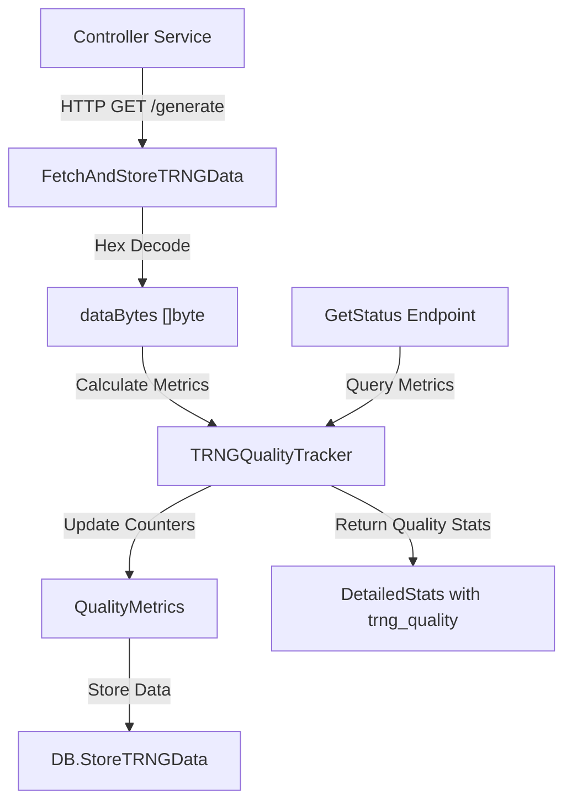
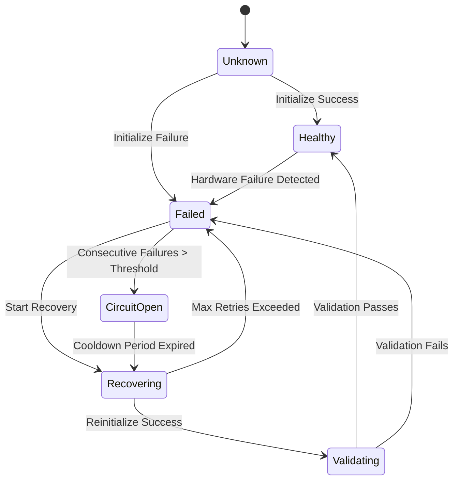

# Architecture

Technical architecture and implementation details of the LoKey system.

## Table of Contents

- [System Overview](#system-overview)
- [Component Architecture](#component-architecture)
- [Data Flow](#data-flow)
- [Controller Service](#controller-service)
- [Fortuna Service](#fortuna-service)
- [VirtIO Service](#virtio-service)
- [API Service](#api-service)
- [Database Design](#database-design)
- [Communication Patterns](#communication-patterns)
- [Security Considerations](#security-considerations)

## System Overview

LoKey is a microservices-based true random number generation system designed for high availability and throughput. The architecture separates concerns into four independent services that communicate via HTTP REST APIs.

### Design Principles

1. **Separation of Concerns** - Each service has a single, well-defined responsibility
2. **Stateless Services** - Controller and Fortuna services maintain no persistent state
3. **Centralized Storage** - API service manages all data persistence
4. **Fault Tolerance** - Services can restart independently without data loss
5. **Horizontal Scalability** - Fortuna services can be replicated for higher throughput

### High-Level Architecture
```

┌─────────────────────────────────────────────────────────────────┐
│                         Client Applications                      │
└────────────────────────────┬────────────────────────────────────┘
│
│ HTTP REST API
│
▼
┌─────────────────────────────────────────────────────────────────┐
│                          API Service                             │
│  ┌──────────────────────────────────────────────────────────┐   │
│  │  • REST API Endpoints                                     │   │
│  │  • Request Validation                                     │   │
│  │  • Data Format Conversion                                 │   │
│  │  • Queue Management                                       │   │
│  │  • Statistics & Metrics                                   │   │
│  └──────────────────────────────────────────────────────────┘   │
│                             │                                    │
│  ┌──────────────────────────┼───────────────────────────────┐   │
│  │         BoltDB Database  │                               │   │
│  │  • TRNG Data Queue      │                               │   │
│  │  • Fortuna Data Queue   │                               │   │
│  │  • (VirtIO has own queue)│                               │   │
│  │  • Configuration        │                               │   │
│  │  • Counters & Stats     │                               │   │
│  └──────────────────────────┼───────────────────────────────┘   │
└─────────────────────────────┼────────────────────────────────────┘
│
┌───────────┴───────────┬───────────┴───────────┐
│                      │                       │
▼                      ▼                       ▼
┌─────────────────────┐ ┌─────────────────────┐ ┌─────────────────────┐
│ Controller Service  │ │  Fortuna Service    │ │  VirtIO Service     │
│                     │ │                     │ │                     │
│ ┌─────────────────┐ │ │ ┌─────────────────┐ │ │ ┌─────────────────┐ │
│ │  I2C Interface  │ │ │ │ Fortuna CSPRNG  │ │ │ │ Named Pipe      │ │
│ │  ATECC608A Ops  │ │ │ │ Entropy Pools   │ │ │ │ HTTP Streaming  │ │
│ │  Random Gen     │ │ │ │ Amplification   │ │ │ │ Circular Queue  │ │
│ │  Health Check   │ │ │ │ Reseeding       │ │ │ │ Health Check    │ │
│ └─────────────────┘ │ │ └─────────────────┘ │ │ └─────────────────┘ │
│         │           │ │                     │ │         │           │
│         ▼           │ │                     │ │         ▼           │
│ ┌─────────────────┐ │ │                     │ │ ┌─────────────────┐ │
│ │   ATECC608A     │ │ │                     │ │ │  VMs/Containers │ │
│ │  Hardware Chip  │ │ │                     │ │ │  (via Pipe/HTTP)│ │
│ └─────────────────┘ │ │                     │ │ └─────────────────┘ │
└─────────────────────┘ └─────────────────────┘ └─────────────────────┘
Hardware TRNG           Cryptographic PRNG      VirtIO Consumer
(~10 samples/sec)       (High throughput)       (Seeded by API)
```
## Component Architecture

### Controller Service (Port 8081)

**Purpose:** Interface with ATECC608A hardware for true random number generation.

**Responsibilities:**
- Initialize and configure ATECC608A chip
- Generate hardware random numbers on demand
- Provide health status
- Handle I2C communication

**Technology:**
- Go 1.24
- `github.com/d2r2/go-i2c` for I2C communication
- Gin web framework
- Stateless design

**Key Features:**
- One-time device configuration (irreversible)
- Fallback to time-based entropy if hardware unavailable
- Automatic wake/sleep cycles for power efficiency
- CRC validation for data integrity

### Fortuna Service (Port 8082)

**Purpose:** Cryptographic amplification of random data using the Fortuna algorithm.

**Responsibilities:**
- Accept seed data from TRNG
- Generate high-throughput random data
- Maintain entropy pools
- Periodic reseeding

**Technology:**
- Go 1.24
- AES-256 cipher for generation
- SHA-256 for pool hashing
- Gin web framework
- Stateless design

**Key Features:**
- 32 entropy pools for catastrophic reseeding resistance
- Cryptographically secure output
- High throughput generation (1000s/sec)
- Automatic pool rotation
- Seed quality validation (entropy and pattern checks)
- Configurable health check intervals
- Explicit health state management

### VirtIO Service (Port 8083 HTTP)

**Purpose:** Provide high-throughput random data access for virtualization environments via named pipe (FIFO) and HTTP streaming. VirtIO is a **consumer endpoint** that serves data to VMs/containers. It does NOT read from hardware devices - all data comes from its queue, which is seeded by the API service.

**Responsibilities:**
- Accept seed data from API service (TRNG or Fortuna)
- Maintain internal circular queue for seeded data (100-500 KB capacity)
- Serve data to local VMs via named pipe (FIFO) - high-performance, low-latency
- Serve data to remote clients/Kubernetes via HTTP streaming endpoint
- Provide HTTP management API (port 8083)
- Provide health status (queue-based, not device-based)
- Support runtime queue size configuration
- **Note**: Device access (`/dev/hwrng`) is NOT required - VirtIO works purely from seeded queue data

**Technology:**
- Go 1.24
- Gin web framework (HTTP API)
- Named pipe (FIFO) for local VM access
- HTTP chunked streaming for network access
- In-memory circular queue (channel-based only)
- **No device access required** - works purely from seeded queue

**Key Features:**
- **Dual Access Methods**:
  - **Named Pipe (FIFO)**: High-performance local access for hypervisors (QEMU, Proxmox, VirtualBox, VMware)
    - Default path: `/var/run/lokey/virtio-rng`
    - ~500x faster than legacy EGD protocol
    - Blocking writes (standard FIFO behavior)
    - Automatic reconnection when reader disconnects
  - **HTTP Streaming (Port 8083)**: Network access for remote servers and Kubernetes sidecars
    - Endpoint: `GET /stream`
    - Chunked transfer encoding
    - Configurable chunk size and max bytes
    - Graceful client disconnection handling
- **HTTP API (Port 8083)**: Management, monitoring, seeding endpoints
  - `GET /health` - Health check
  - `GET /info` - Service information (includes pipe path)
  - `GET /generate` - Pull data from queue (testing/debugging)
  - `GET /stream` - Continuous data streaming
  - `POST /seed` - Accept seed data from API service
  - `GET /config/queue` - Get queue configuration
  - `PUT /config/queue` - Update queue size
- Circular queue for storing seeded data (default: 15,000 items ≈ 480 KB)
- **Consumer-only operation**:
  - Accepts seed data via `/seed` endpoint (from API service)
  - Serves data via named pipe to local VMs
  - Serves data via HTTP streaming to remote clients
- Runtime queue size updates via `/config/queue` endpoint
- Graceful handling of pipe reader disconnections
- Thread-safe concurrent access

**Named Pipe (FIFO) Details:**

The named pipe provides a high-performance interface for local hypervisor access:

- **Path**: Configurable via `VIRTIO_PIPE_PATH` (default: `/var/run/lokey/virtio-rng`)
- **Creation**: Automatically created on service startup
- **Permissions**: 0666 (read/write for all)
- **Behavior**: Blocking writes (standard FIFO behavior - blocks when pipe buffer is full)
- **Reconnection**: Automatically reopens pipe when reader disconnects
- **Performance**: ~500x faster than legacy EGD protocol
- **Queue Integration**: Continuously reads from circular queue and writes to pipe

**HTTP Streaming Details:**

The HTTP streaming endpoint enables network-based access:

- **Endpoint**: `GET /stream`
- **Query Parameters**:
  - `chunk_size` (optional, default: 1024): Bytes per chunk
  - `max_bytes` (optional): Maximum total bytes to stream
- **Headers**:
  - `Content-Type: application/octet-stream`
  - `Transfer-Encoding: chunked`
- **Behavior**: Continuously streams data from queue until client disconnects or max_bytes reached
- **Use Cases**: Remote servers, Kubernetes sidecars, network-based access

**Use Cases:**
- **Local VMs**: QEMU, Proxmox, VirtualBox, VMware via named pipe
- **Kubernetes/OpenShift**: Sidecar container reads from HTTP stream and provides pipe to pod
- **Remote Servers**: Network-based access via HTTP streaming
- **Cloud Deployments**: Where hardware TRNG is unavailable
- **Development and Testing**: High-throughput entropy for testing environments

### API Service (Port 8080)

**Purpose:** Unified REST API, data storage, and queue management.

**Responsibilities:**
- Accept client requests
- Poll controller and fortuna services (VirtIO is NOT polled - it's a consumer endpoint)
- Store random data in queues (TRNG and Fortuna only)
- Serve data in multiple formats
- Track statistics and metrics
- Health monitoring
- **Seed VirtIO service** (configurable source: TRNG, Fortuna, or both) - data flows one way: API → VirtIO

**Technology:**
- Go 1.24
- BoltDB for persistence
- Gin web framework
- Prometheus metrics
- Swagger/OpenAPI documentation

**Key Features:**
- Multiple data formats (int8-64, uint8-64, binary)
- Configurable queue sizes (TRNG, Fortuna, VirtIO)
- Consumption tracking
- Delete-on-read behavior
- Comprehensive statistics
- VirtIO seeding configuration (TRNG, Fortuna, or both)
- Runtime configuration updates for VirtIO

## Data Flow

### TRNG Data Flow
```

┌──────────────┐
│ ATECC608A    │
│ Hardware     │
└──────┬───────┘
│ 1. Generate 32 bytes
│    true random data
▼
┌──────────────┐
│ Controller   │
│ Service      │ 2. Expose via /generate endpoint
└──────┬───────┘
│
│ 3. API polls periodically
│    (TRNG_POLL_INTERVAL_MS)
▼
┌──────────────┐
│ API Service  │
│              │ 4. Store in TRNG queue
│ ┌──────────┐ │    (max: TRNG_QUEUE_SIZE)
│ │ BoltDB   │ │
│ │ TRNG     │ │ 5. Mark as unconsumed
│ │ Queue    │ │
│ └──────────┘ │
└──────┬───────┘
│
│ 6. Client requests data
▼
┌──────────────┐
│ Client       │ 7. Returns data in requested format
│ Application  │    (int8, uint64, binary, etc.)
└──────────────┘    Marks as consumed (deleted)
```
### Fortuna Data Flow
```

┌──────────────┐
│ Controller   │
│ Service      │ 1. API fetches TRNG data
└──────┬───────┘
│
│ 2. API sends seeds to Fortuna
▼
┌──────────────┐
│ Fortuna      │
│ Service      │ 3. Add to entropy pools
│              │
│ ┌──────────┐ │ 4. Reseed generator
│ │ 32 Pools │ │
│ │ AES-256  │ │ 5. Generate amplified data
│ └──────────┘ │
└──────┬───────┘
│
│ 6. API polls /generate
│    (FORTUNA_POLL_INTERVAL_MS)
▼
┌──────────────┐
│ API Service  │
│              │ 7. Store in Fortuna queue
│ ┌──────────┐ │    (max: FORTUNA_QUEUE_SIZE)
│ │ BoltDB   │ │
│ │ Fortuna  │ │ 8. Mark as unconsumed
│ │ Queue    │ │
│ └──────────┘ │
└──────┬───────┘
│
│ 9. Client requests data
▼
┌──────────────┐
│ Client       │ 10. Returns high-throughput data
│ Application  │     Marks as consumed (deleted)
└──────────────┘
```
### Fortuna Seeding Flow
```

Every 30 seconds:

┌──────────────┐
│ API Service  │
│              │ 1. Fetch 5 TRNG samples
│              │    from Controller
└──────┬───────┘
│
│ 2. POST to /seed endpoint
▼
┌──────────────┐
│ Fortuna      │
│ Service      │ 3. Distribute seeds across pools
│              │
│ ┌──────────┐ │ 4. Hash pools with SHA-256
│ │ Pools    │ │
│ │ 0-31     │ │ 5. Reseed AES generator
│ └──────────┘ │
│              │ 6. Increment counter
└──────────────┘    (determines next pools to use)
```

### VirtIO Seeding Flow
```

Every 30 seconds (configurable):

┌──────────────┐
│ API Service  │
│              │ 1. Fetch data from TRNG or Fortuna
│              │    (based on VIRTIO_SEEDING_SOURCE)
└──────┬───────┘
│
│ 2. POST to /seed endpoint
│    (validates data quality)
▼
┌──────────────┐
│ VirtIO       │
│ Service      │ 3. Store seeds in circular queue
│              │
│ ┌──────────┐ │ 4. Queue serves data via:
│ │ Circular │ │    - Named pipe (FIFO) for local VMs
│ │ Queue    │ │    - HTTP streaming for remote/K8s
│ └──────────┘ │
└──────┬───────┘
│
│ 5a. Local VMs read from pipe
│     (QEMU, Proxmox, VirtualBox, VMware)
│ 5b. Remote/K8s read from HTTP stream
▼
┌──────────────┐
│ QEMU/VM      │ 6. Consumes entropy for
│ Container    │    virtualization needs
│ Kubernetes   │
└──────────────┘

Note: Data flows ONE WAY - API seeds VirtIO, VirtIO serves VMs.
      API does NOT poll VirtIO (it's a consumer endpoint).
      Named pipe provides ~500x better performance than legacy EGD.
```
## Controller Service

### ATECC608A Implementation

The controller implements precise I2C communication with the ATECC608A cryptographic chip, following Adafruit's reference implementation.

**Hardware Communication:**
```

┌─────────────────────────────────────────────────────────────┐
│                    Command Sequence                          │
└─────────────────────────────────────────────────────────────┘
        │
        ▼
┌───────────────┐
│ Wake Device   │ • Send to I2C address 0x00
│ (1ms delay)   │ • Wait 1ms for device ready
└───────┬───────┘
        │
        ▼
┌───────────────┐
│ Send Command  │ • Build packet: [0x03][Count][Opcode][Param1]
│               │                 [Param2][Data][CRC16]
└───────┬───────┘ • CRC with polynomial 0x8005
        │
        ▼
┌───────────────┐
│ Wait for      │ • Command-specific delay:
│ Execution     │   - Random: 23ms
└───────┬───────┘   - Info: 1ms
        │           - Config: 35ms
        ▼
┌───────────────┐
│ Read Response │ • Retry up to 20 times
│               │ • Parse: [Length][Status][Data][CRC16]
└───────┬───────┘
        │
        ▼
┌───────────────┐
│ Process Data  │ • Skip status byte
│               │ • Extract random data (32 bytes)
└───────┬───────┘ • Apply SHA-256 hash
        │
        ▼
┌───────────────┐
│ Return Hash   │ • Return 32-byte hash
│               │ • Put device to idle
└───────────────┘
```
**Device Configuration:**

The ATECC608A must be configured once before use. This is an **irreversible operation**.

Configuration process (**one-time only**)
1. Check if device is locked
2. If unlocked and FORCE_CONFIG=true:
   - Write TLS configuration template (128 bytes)
   - Write in 4-byte blocks to addresses 16-127
   - Skip read-only sections
3. Send lock command (0x17)
4. Verify lock status
5. Device is now permanently configured


**Safety Mechanisms:**
- Requires `FORCE_CONFIG=true` environment variable
- Logs all operations for audit trail
- Checks lock status before attempting configuration
- Fallback to time-based entropy if hardware fails

### Endpoints

**GET /health**
- Returns device health status
- Tests I2C communication
- Validates device responsiveness

**GET /info**
- Returns service information
- Device status
- Configuration state

**GET /generate?count=N**
- Generates N random values (1-100)
- Returns hex-encoded hashes
- Each hash is 32 bytes (256 bits)

## Fortuna Service

### Algorithm Implementation

LoKey implements the Fortuna cryptographically secure pseudo-random number generator designed by Bruce Schneier and Niels Ferguson.

**Core Components:**

```
┌─────────────────────────────────────────────────────────────┐
│                    Fortuna Generator                        │
└─────────────────────────────────────────────────────────────┘
│
├──► AES-256 Cipher (key: 256 bits)
│
├──► Counter (64-bit, increments per block)
│
└──► 32 Entropy Pools
│
├──► Pool 0  (used every reseed)
├──► Pool 1  (used every 2nd reseed)
├──► Pool 2  (used every 4th reseed)
├──► Pool 3  (used every 8th reseed)
│    ...
└──► Pool 31 (used every 2^31 reseeds)
```


**Generation Process:**

```textmate
// Pseudo-code
func GenerateRandomData(length int) []byte {
    result := make([]byte, length)
    blocks := (length + blockSize - 1) / blockSize
    
    for i := 0; i < blocks; i++ {
        // Encrypt counter value
        counterBytes := encodeCounter(counter)
        block := aesEncrypt(key, counterBytes)
        
        // Copy to result
        copy(result[i*blockSize:], block)
        
        // Increment counter
        counter++
    }
    
    return result
}
```


**Reseeding Logic:**

```textmate
// Pseudo-code
func ReseedFromPools() {
    reseedCount := counter
    poolsToUse := [][]byte{}
    
    for i := 0; i < 32; i++ {
        // Use pool if bit i is set in reseedCount
        if (reseedCount & (1 << i)) != 0 {
            if len(pools[i]) > 0 {
                poolsToUse = append(poolsToUse, pools[i])
                pools[i] = pools[i][:0]  // Clear pool
            }
        }
    }
    
    // Hash all pool data with current key
    newKey := sha256(key || poolsToUse...)
    
    // Update cipher with new key
    cipher = aes.NewCipher(newKey)
    counter++
}
```


**Catastrophic Reseeding:**

The pool selection algorithm ensures that even if an attacker compromises the state:
- Pool 0 is used every reseed (fast recovery)
- Pool 31 is used every 2^31 reseeds (long-term security)
- After 32 reseeds with fresh entropy, attacker's knowledge is worthless

### Endpoints

**GET /health**
- Returns generator health
- Checks last reseed time
- Validates entropy state

**GET /info**
- Returns service information
- Last reseed timestamp
- Generation counter

**GET /generate?size=N**
- Generates N bytes (1-1048576)
- Returns hex-encoded data
- High throughput

**POST /seed**
- Accepts array of hex-encoded seeds
- Distributes to entropy pools

## VirtIO Service

### Implementation Details

The VirtIO service provides high-throughput random data access for virtualization environments via named pipe (FIFO) and HTTP streaming.

**Device Access:**
- **NOT REQUIRED** - VirtIO service does not read from hardware devices
- All data comes from the seeded queue (populated by API service)
- Device paths are ignored - VirtIO works purely from seeded data

**Queue Management:**
- Internal circular queue for seeded data
- Configurable size via `VIRTIO_QUEUE_SIZE` (default: 15,000 items ≈ 480 KB)
- Target capacity: 100-500 KB
- FIFO behavior (oldest data removed when full)
- Thread-safe concurrent access
- Runtime size updates via `/config/queue` endpoint
- Byte-based capacity calculation: `GetQueueSizeBytes()` = items × 32 bytes

**Operation Mode:**
- **Consumer Mode Only**: Accepts seed data via `/seed` endpoint and stores in queue
- Serves data to local VMs via named pipe (FIFO) - high-performance, low-latency
- Serves data to remote clients/Kubernetes via HTTP streaming
- `/generate` endpoint pulls from queue (for testing/debugging only, not for production API consumption)

**Named Pipe (FIFO) Implementation:**
- Created at path specified by `VIRTIO_PIPE_PATH` (default: `/var/run/lokey/virtio-rng`)
- Automatically created on service startup
- Permissions: 0666 (read/write for all)
- Blocking writes (standard FIFO behavior - blocks when pipe buffer is full)
- Automatic reconnection when reader disconnects
- Continuously reads from circular queue and writes to pipe
- ~500x faster than legacy EGD protocol

**HTTP Streaming Implementation:**
- Endpoint: `GET /stream`
- Chunked transfer encoding for continuous streaming
- Configurable chunk size and max bytes via query parameters
- Graceful client disconnection handling
- Suitable for remote servers and Kubernetes sidecars

### Endpoints

**GET /health**
- Returns service health status
- Checks queue availability (device access not checked)
- Returns 200 if healthy (queue exists and has capacity), 503 if unhealthy

**GET /info**
- Returns service information
- Current queue status
- Named pipe path

**GET /generate?count=N**
- Generates N random values (1-100)
- **Pulls from queue** (not from device)
- Returns hex-encoded data (32 bytes per value)
- **Note**: This endpoint is for testing/debugging. Production VMs should use named pipe or HTTP streaming

**GET /stream?chunk_size=N&max_bytes=M**
- Streams random data continuously
- Query parameters:
  - `chunk_size` (optional, default: 1024): Bytes per chunk
  - `max_bytes` (optional): Maximum total bytes to stream
- Headers: `Content-Type: application/octet-stream`, `Transfer-Encoding: chunked`
- Use cases: Remote servers, Kubernetes sidecars, network-based access

**POST /seed**
- Accepts array of hex-encoded seeds
- Stores seeds in circular queue
- Returns count of successfully seeded items

**GET /config/queue**
- Returns current queue configuration
- Queue size and current usage

**PUT /config/queue**
- Updates queue size dynamically
- Migrates existing data if possible
- Accepts `{"queue_size": <number>}` (10-1000000)

## API Service

### Request Processing

```
Client Request
     │
     ▼
┌─────────────────┐
│ Gin Router      │
│ (HTTP Handler)  │
└────────┬────────┘
         │
         ▼
┌─────────────────┐
│ Validation      │ • Check format (int8-64, uint8-64, binary)
│                 │ • Validate limit (1-100000)
└────────┬────────┘ • Verify source (trng/fortuna)
         │
         ▼
┌─────────────────┐
│ Calculate       │ • Bytes needed = count × bytesPerValue
│ Requirements    │ • Chunks needed = bytes / 31 + buffer
└────────┬────────┘
         │
         ▼
┌─────────────────┐
│ Database Query  │ • GetTRNGData() or GetFortunaData()
│                 │ • Mark as consumed
└────────┬────────┘ • Increment counters
         │
         ▼
┌─────────────────┐
│ Format          │ • Convert raw bytes to requested format
│ Conversion      │ • Apply big-endian byte order
└────────┬────────┘ • Handle signed/unsigned
         │
         ▼
┌─────────────────┐
│ Response        │ • JSON array for numeric types
│                 │ • Binary stream for binary format
└─────────────────┘ • Set appropriate Content-Type
```


### Polling Mechanism

The API service uses background goroutines to continuously poll the controller and fortuna services:

```textmate
// Simplified polling logic
func pollTRNGService(ctx context.Context, interval time.Duration) {
    ticker := time.NewTicker(interval)
    defer ticker.Stop()
    
    for {
        select {
        case <-ctx.Done():
            return
        case <-ticker.C:
            // Fetch from controller
            data := fetchFromController()
            
            // Calculate quality metrics BEFORE storing
            qualityTracker.ProcessData(data)
            
            // Store in database
            db.StoreTRNGData(data)
            
            // Increment counter
            db.IncrementPollingCount("trng")
        }
    }
}
```


**Polling Configuration:**
- `TRNG_POLL_INTERVAL_MS`: How often to fetch TRNG data (default: 1000ms)
- `FORTUNA_POLL_INTERVAL_MS`: How often to fetch Fortuna data (default: 5000ms)
- Fortuna seeding: Every 30 seconds with 5 TRNG samples

### Queue Management

```
Data arrives from polling
        │
        ▼
┌─────────────────┐
│ Add to Queue    │ • Assign sequential ID
│                 │ • Set timestamp
└────────┬────────┘ • Mark as unconsumed
         │
         ▼
    Queue Full?
         │
    ┌────┴────┐
   Yes        No
    │          │
    ▼          ▼
┌────────┐ ┌────────┐
│ Drop   │ │ Store  │
│ Oldest │ │ New    │
└───┬────┘ └───┬────┘
    │          │
    │ Increment│
    │ dropped  │
    │ counter  │
    └────┬─────┘
         │
         ▼
    Queue Ready
```


**Queue Characteristics:**
- FIFO (First In, First Out)
- Configurable capacity
- Automatic trimming when full
- Consumption tracking
- Metrics for drops and utilization

## Database Design

### BoltDB Schema

LoKey uses BoltDB, an embedded key-value store with ACID guarantees.

**Buckets:**

```
lokey.db
├── trng_data          # TRNG random data
│   ├── [id: uint64] → TRNGData JSON
│   ├── [id: uint64] → TRNGData JSON
│   └── ...
│
├── fortuna_data       # Fortuna random data
│   ├── [id: uint64] → FortunaData JSON
│   ├── [id: uint64] → FortunaData JSON
│   └── ...
│
├── counters           # System counters
│   ├── trng_next_id → uint64
│   ├── fortuna_next_id → uint64
│   ├── trng_polling_count → uint64
│   ├── fortuna_polling_count → uint64
│   ├── trng_dropped_count → uint64
│   ├── fortuna_dropped_count → uint64
│   ├── trng_consumed_count → uint64
│   └── fortuna_consumed_count → uint64
│
├── config             # Configuration
│   ├── trng_queue_size → uint64
│   └── fortuna_queue_size → uint64
│
└── usage_stats        # Usage statistics
    ├── [source_timestamp] → UsageStat JSON
    └── ...
```


**Data Structures:**

```textmate
type TRNGData struct {
    ID        uint64    `json:"id"`
    Data      []byte    `json:"data"`
    Timestamp time.Time `json:"timestamp"`
    Consumed  bool      `json:"consumed"`
}

type FortunaData struct {
    ID        uint64    `json:"id"`
    Data      []byte    `json:"data"`
    Timestamp time.Time `json:"timestamp"`
    Consumed  bool      `json:"consumed"`
}

type UsageStat struct {
    Source    string    `json:"source"`
    BytesUsed int64     `json:"bytes_used"`
    Requests  int64     `json:"requests"`
    Timestamp time.Time `json:"timestamp"`
}
```


**Operations:**

1. **Store**: Add new data with auto-incrementing ID
2. **Retrieve**: Get unconsumed data, optionally mark as consumed
3. **Trim**: Remove oldest entries when queue is full
4. **Count**: Track polling, drops, consumption

## Communication Patterns

### HTTP REST

All inter-service communication uses HTTP REST:

**API → Controller:**
```
GET /generate?count=1 HTTP/1.1
Host: controller:8081

Response:
{
  "data": "a1b2c3d4..."
}
```


**API → Fortuna (Seeding):**
```
POST /seed HTTP/1.1
Host: fortuna:8082
Content-Type: application/json

{
  "seeds": ["a1b2c3...", "d4e5f6...", ...]
}

Response:
{
  "status": "reseeded",
  "count": 5
}
```


**API → Fortuna (Generation):**
```
GET /generate?size=256 HTTP/1.1
Host: fortuna:8082

Response:
{
  "data": "7f8e9d0c...",
  "size": 256
}
```


### Error Handling

- **Retry Logic**: Exponential backoff for recovery attempts
- **Circuit Breaker**: Prevents request storms during persistent failures
- **Recovery Validation**: Post-recovery validation ensures device actually works
- **Seed Validation**: TRNG data validated before seeding Fortuna
- **Logging**: All errors logged with context
- **Health Checks**: Regular polling for service availability

### Randomness Quality Metrics

The API service continuously monitors TRNG data quality using three NIST statistical tests. Metrics are calculated **before** data is stored, ensuring real-time quality assessment.

#### Data Flow with Quality Metrics



#### Monobit (Frequency) Test

**Purpose**: Tests the proportion of zeros and ones in the entire sequence. For truly random data, the proportion should be approximately 0.5 (50% zeros, 50% ones).

**What it detects**: Bias toward zeros or ones, indicating non-randomness or hardware degradation.

**Calculation**:
- Counts total bits processed
- Separately counts zeros and ones
- Calculates average: `average = ones / total`
- For random data: average ≈ 0.5

**Expected Values**:
- **Healthy TRNG**: Average between 0.49 and 0.51
- **Warning**: Average between 0.45-0.49 or 0.51-0.55
- **Critical**: Average < 0.45 or > 0.55

**Storage**: 3 int64 counters + 1 float64 = ~32 bytes

**Example Output**:
```json
{
  "monobit": {
    "zeros": 12345678,
    "ones": 12345678,
    "total": 24691356,
    "average": 0.5000123
  }
}
```

#### NIST SP 800-90B Repetition Count Test

**Purpose**: Detects if a specific value repeats too many times consecutively, which would indicate hardware failure or stuck bits.

**What it detects**: Consecutive identical values exceeding a threshold (default: 35 for 8-bit values).

**Algorithm**:
1. Tracks the most recent sample value
2. Counts consecutive repetitions
3. If count exceeds cutoff (35), increments failure counter
4. Resets count when value changes

**Expected Values**:
- **Healthy TRNG**: `failures = 0`
- **Warning**: `failures > 0` but infrequent
- **Critical**: `failures` increasing rapidly

**Storage**: Small circular buffer (~40 bytes) + counters = ~60 bytes

**Example Output**:
```json
{
  "repetition_count": {
    "failures": 0,
    "current_run": 1,
    "last_value": 66
  }
}
```

#### NIST SP 800-90B Adaptive Proportion Test (APT)

**Purpose**: Detects statistical bias by checking if the proportion of a specific value in a sliding window exceeds expected random distribution.

**What it detects**: Systematic bias where certain values appear more frequently than expected in a window of samples.

**Algorithm**:
1. Maintains a sliding window of recent samples (default: 512 bytes)
2. For each new sample, counts its occurrences in the current window
3. Calculates cutoff: `floor(0.5 × window_size) + 3 × √(window_size × 0.25)`
4. For 512 samples: cutoff ≈ 290
5. If count exceeds cutoff, increments bias counter

**Expected Values**:
- **Healthy TRNG**: `bias_count = 0` or very low
- **Warning**: `bias_count` slowly increasing
- **Critical**: `bias_count` increasing rapidly

**Storage**: Sliding window (512 bytes default, configurable) + metadata = ~536 bytes

**Configuration**:
- `TRNG_APT_WINDOW_SIZE`: Window size in bytes (default: 512, range: 256-2048)
- Larger windows: Better bias detection, more memory
- Smaller windows: Less memory, faster updates, may miss subtle biases

**Example Output**:
```json
{
  "apt": {
    "window_size": 512,
    "cutoff": 290,
    "bias_count": 0,
    "samples_processed": 123456
  }
}
```

#### Total Storage Requirements

**Per-Tracker Storage**:
- Monobit: ~32 bytes
- Repetition Count: ~60 bytes
- APT: ~536 bytes (configurable via `TRNG_APT_WINDOW_SIZE`)
- **Total**: ~628 bytes per tracker instance

**Memory Impact**: Negligible compared to queue sizes (500K items × 31 bytes = 15.5MB)

#### Interpreting Metrics

**Healthy TRNG Indicators**:
- Monobit average: 0.49 - 0.51
- Repetition count failures: 0
- APT bias count: 0 or very low
- All metrics stable over time

**Warning Signs**:
- Monobit average drifting away from 0.5
- Repetition count failures appearing
- APT bias count increasing
- Metrics fluctuating significantly

**Action Items**:
1. **Monobit average outside 0.45-0.55**: Check hardware connections, verify I2C communication
2. **Repetition failures**: Hardware may be stuck or degraded, check device health
3. **APT bias detected**: Possible systematic bias, review hardware configuration
4. **All metrics degraded**: Consider hardware replacement or service restart

### Fault Tolerance and Recovery

The system implements comprehensive fault tolerance mechanisms:

#### Controller Recovery State Machine



**Recovery Process:**
1. **Detection**: Hardware failure detected (0xFF patterns, I2C errors)
2. **Recovery Start**: Device enters RECOVERING state
3. **Reinitialize**: I2C connection recreated, device reinitialized
4. **Validation**: Multiple random samples generated and validated for quality
5. **Cooldown**: Extended validation period (default 30s) with continued checks
6. **Healthy**: Device marked HEALTHY only after all validations pass

**Circuit Breaker:**
- Opens after 5 consecutive failures
- Rejects all requests immediately when OPEN
- Transitions to HALF_OPEN after cooldown (default 5 minutes)
- Closes after successful test request in HALF_OPEN state

**Configuration:**
- `CONTROLLER_RECOVERY_COOLDOWN_SECONDS`: Cooldown period (default: 30)
- `CONTROLLER_RECOVERY_VALIDATION_ATTEMPTS`: Validation samples (default: 3)
- `CONTROLLER_CIRCUIT_BREAKER_COOLDOWN_MINUTES`: Circuit breaker cooldown (default: 5)

#### Fortuna Health Management

**Health Check Criteria:**
- Generator must be explicitly healthy (`IsHealthy = true`)
- Last reseed must be within max interval (default: 1 hour, configurable)
- Seed data validated for entropy and pattern quality

**Seed Validation:**
- Rejects seeds with >90% same byte value (0xFF patterns)
- Requires minimum Shannon entropy (3.0 bits per byte)
- Validates all seeds before accepting for reseeding

**Configuration:**
- `FORTUNA_MAX_RESEED_INTERVAL_HOURS`: Max time between reseeds (default: 1)

#### Cascade Failure Prevention

The API service prevents cascade failures through:

1. **TRNG Data Validation**: All controller data validated before use
2. **Seed Quality Checks**: Fortuna seeds validated for entropy
3. **Circuit Breaker**: Stops seeding attempts when controller consistently fails
4. **Health State Tracking**: Proper state management across services

## Security Considerations

### Cryptographic Properties

**TRNG (Hardware):**
- True entropy from physical processes
- Passes NIST statistical tests (when using ATECC608A)
- No algorithmic predictability
- Limited by hardware generation rate

**Fortuna (Amplified):**
- Cryptographically secure (AES-256, SHA-256)
- Forward secrecy (compromising state doesn't reveal past outputs)
- Resilient to state compromise (through pool rotation)
- Periodic reseeding with TRNG maintains entropy

### Attack Surface

**Hardware Tampering:**
- Physical access required to manipulate ATECC608A
- I2C communication not encrypted (local bus only)
- Mitigation: Secure physical access to device

**Network Attacks:**
- Internal HTTP communication not encrypted
- No authentication between services
- Mitigation: Use Docker internal networks, add reverse proxy with TLS

**State Compromise:**
- If Fortuna state is compromised, attacker can predict future outputs
- Mitigation: Regular reseeding (every 30s), pool rotation

**Denial of Service:**
- Queue exhaustion through rapid consumption
- Mitigation: Rate limiting (not implemented), queue size tuning

### Best Practices

1. **Use TRNG for cryptographic keys** - Highest quality randomness
2. **Use Fortuna for high-volume needs** - Balance speed and security
3. **Deploy behind reverse proxy** - Add TLS, authentication, rate limiting
4. **Monitor queue levels** - Alert on low levels or high drops
5. **Secure physical access** - Protect Raspberry Pi and ATECC608A
6. **Regular backups** - Backup database for statistics (not random data)

## Performance Characteristics

### Throughput

**TRNG (Hardware):**
- Generation: ~10 hashes/second
- Polling overhead: ~100ms per poll
- Network latency: ~1-5ms (local Docker network)
- Database write: ~1ms per record
- **Effective rate**: ~8-10 samples/second

**Fortuna (Amplified):**
- Generation: 1000s/second (CPU-limited)
- AES-256 encryption: ~100MB/s (typical)
- Network latency: ~1-5ms
- Database write: ~1ms per record
- **Effective rate**: Limited by polling interval and queue size

### Latency

**First Request:**
- TRNG: 0-10 seconds (queue build-up)
- Fortuna: 0-5 seconds (queue build-up)

**Subsequent Requests:**
- If queue has data: <10ms
- If queue empty: Wait for next poll cycle

### Resource Usage

**Controller:**
- CPU: <5% (polling)
- Memory: ~10MB
- I2C: Minimal, periodic access

**Fortuna:**
- CPU: 10-30% (generation + polling)
- Memory: ~20MB (entropy pools)

**API:**
- CPU: 5-15% (request handling + polling)
- Memory: ~50MB base + (queue size × 31 bytes × 2)
- Disk: Grows with queue size, ~1KB per 31 bytes

**Example:**
- TRNG queue: 1000 items × 31 bytes = 31KB
- Fortuna queue: 5000 items × 256 bytes = 1.25MB
- Total DB size: ~2-5MB (with metadata and indexes)

## Scalability

### Vertical Scaling

**Increase throughput on single instance:**
- Increase `FORTUNA_QUEUE_SIZE` for more buffering
- Decrease `FORTUNA_POLL_INTERVAL_MS` for faster generation
- Increase `AMPLIFICATION_FACTOR` for more output per seed

### Horizontal Scaling

**Multiple Fortuna instances:**
```yaml
services:
  fortuna-1:
    image: lokey-fortuna
    ports: ["8082:8082"]
  
  fortuna-2:
    image: lokey-fortuna
    ports: ["8083:8082"]
  
  api:
    environment:
      - FORTUNA_ADDR=http://fortuna-1:8082
      # Poll multiple instances in round-robin
```


**Load balancing:**
- Use Nginx/HAProxy in front of API
- Multiple API instances with shared database (requires locking)
- Read replicas for statistics queries

### Limitations

- **Single ATECC608A**: Hardware generation rate is fixed (~10/sec)
- **Single BoltDB**: Write throughput limited by disk I/O
- **No distributed state**: Cannot share queues across API instances

## Next Steps

- **[Deployment Guide](deployment.md)** - Deploy to production
- **[API Examples](api-examples.md)** - Learn API usage
- **[Development Guide](development.md)** - Contribute to the project
- **[Hardware Setup](hardware-setup.md)** - Configure ATECC608A chip
