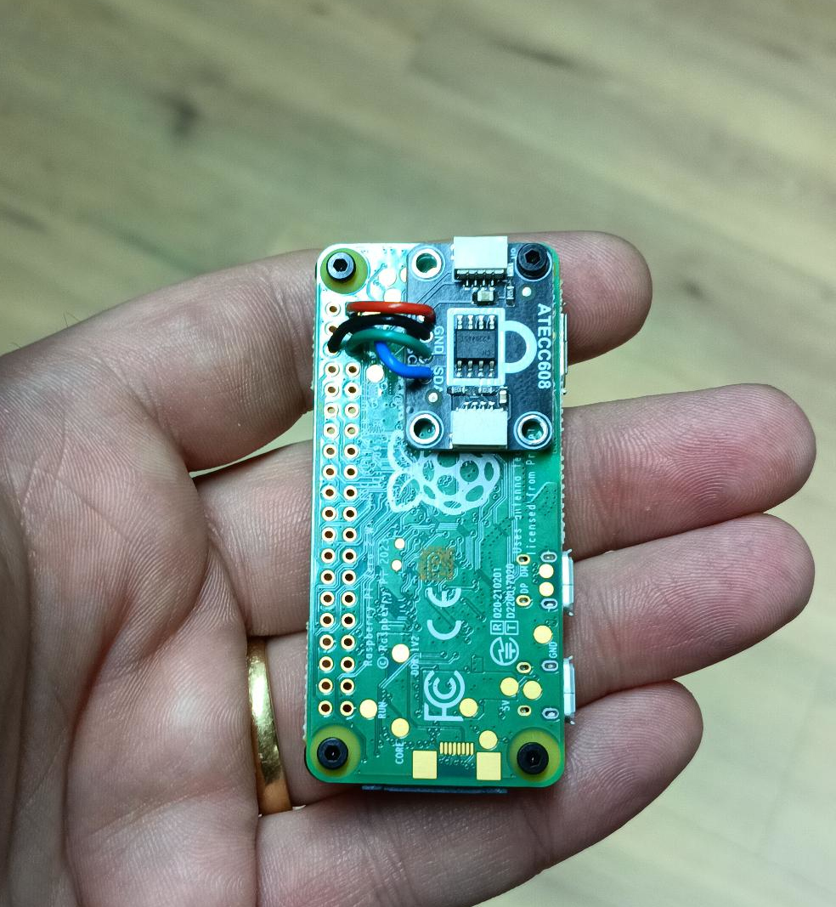
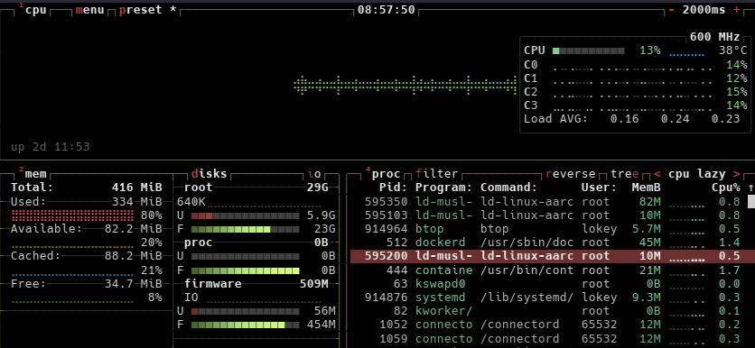
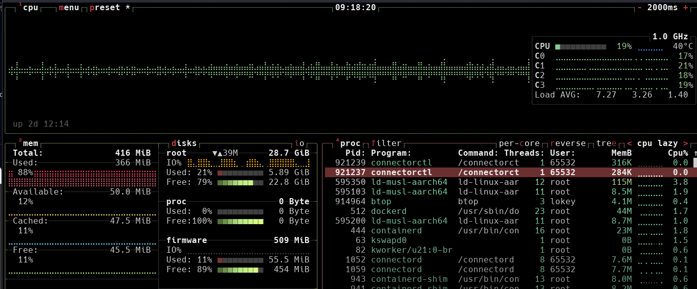

# Hardware Setup Guide

Complete guide for setting up Raspberry Pi Zero 2 W with ATECC608A cryptographic chip for LoKey.

## Table of Contents

- [Overview](#overview)
- [Hardware Requirements](#hardware-requirements)
- [Hardware Connection](#hardware-connection)
- [SD Card Configuration](#sd-card-configuration)
- [Initial Boot and Access](#initial-boot-and-access)
- [I2C and ATECC608A Configuration](#i2c-and-atecc608a-configuration)
- [Docker Installation](#docker-installation)
- [Deploy LoKey Services](#deploy-lokey-services)
- [Troubleshooting](#troubleshooting)

## Overview

This guide walks you through setting up a Raspberry Pi Zero 2 W with an ATECC608A secure element for hardware-based true random number generation. The setup enables USB serial access, I2C communication, and prepares the system for running LoKey services.

**Estimated time:** 1-2 hours

**Difficulty:** Intermediate (requires soldering)

## Hardware Requirements

| Component                  | Quantity | Purpose                          | Approximate Cost |
|----------------------------|----------|----------------------------------|------------------|
| Raspberry Pi Zero 2 W      | 1        | Main computing platform          | €15-20           |
| ATECC608A chip/breakout    | 1        | Hardware TRNG source             | €2-5             |
| MicroSD card (8GB+)        | 1        | Operating system storage         | €5-10            |
| Micro USB cable (data)     | 1        | Power and serial communication   | €3-5             |
| Soldering equipment        | -        | Connecting ATECC608A             | -                |
| Wire (4 pieces)            | -        | GPIO connections                 | €1               |

**Total cost:** ~€30-50

## Hardware Connection

### ATECC608A Wiring

**⚠️ Safety First:** Power off and disconnect the Raspberry Pi before soldering.

Connect the ATECC608A to the Raspberry Pi GPIO header:

| ATECC608A Pin | Raspberry Pi GPIO Pin | Pi Pin Number | Function    |
|---------------|-----------------------|---------------|-------------|
| VCC           | 3.3V                  | Pin 1         | Power       |
| SDA           | GPIO 2 (SDA)          | Pin 3         | I2C Data    |
| SCL           | GPIO 3 (SCL)          | Pin 5         | I2C Clock   |
| GND           | Ground                | Pin 6         | Ground      |



### Soldering Steps

1. **Prepare Wires**
   - Cut four ~5cm wire pieces
   - Strip 2-3mm insulation from both ends

2. **Tin Wires**
   - Apply small amount of solder to stripped ends
   - Creates reliable connections

3. **Solder to ATECC608A**
   - Connect wires to VCC, SDA, SCL, and GND pads
   - Use minimal solder to avoid bridges

4. **Solder to Raspberry Pi**
   - Connect to GPIO header pins as per table above
   - Pin 1 is closest to corner with square pad

5. **Inspect Connections**
   - Check for shiny, conical solder joints
   - **Critical:** Verify no solder bridges between adjacent pins
   - Test continuity with multimeter (optional but recommended)

## SD Card Configuration

### Flash Raspberry Pi OS

1. Download [Raspberry Pi Imager](https://www.raspberrypi.com/software/)
2. Flash **Raspberry Pi OS Lite (64-bit)** to SD card
3. Before ejecting, mount the `boot` partition

### Configure Boot Files

**Edit `config.txt`:**

Reference configuration available at [`docs/assets/config.txt`](assets/config.txt)

Key changes:
```ini
# Enable I2C
dtparam=i2c_arm=on
dtparam=i2c_arm_baudrate=100000

# Enable USB gadget mode
dtoverlay=dwc2,dr_mode=peripheral

# 64-bit mode
arm_64bit=1
```
```


**Edit `cmdline.txt`:**

Reference configuration available at [`docs/assets/configs/cmdline.txt`](assets/configs/cmdline.txt)

**Append** `modules-load=dwc2,g_serial` to the existing single line (space-separated, no line breaks):

```
console=serial0,115200 console=tty1 root=PARTUUID=xxxxxxxx-xx rootfstype=ext4 fsck.repair=yes rootwait modules-load=dwc2,g_serial quiet init=/usr/lib/raspi-config/init_resize.sh
```


**Enable SSH:**

Create empty file named `ssh` (no extension) in `boot` partition:

```shell script
touch /Volumes/boot/ssh  # macOS
# or
touch /media/username/boot/ssh  # Linux
```


**Configure Serial Console (Optional):**

For USB serial access, enable getty on `ttyGS0`:

```shell script
# Mount root filesystem
sudo mkdir -p /mnt/pi-root
sudo mount /dev/sdX2 /mnt/pi-root  # Replace sdX2 with your device

# Enable serial console
sudo ln -s /lib/systemd/system/serial-getty@.service \
  /mnt/pi-root/etc/systemd/system/getty.target.wants/serial-getty@ttyGS0.service

# Unmount
sudo umount /mnt/pi-root
```


## Initial Boot and Access

### Boot the Pi

1. Safely eject SD card from computer
2. Insert SD card into Raspberry Pi Zero 2 W
3. Connect **data/power micro-USB port** (closer to board edge) to computer

**Note:** Use the port labeled "USB" or the one closer to the corner, not the "PWR IN" port.

### Access via Serial Console

Your computer should recognize the Pi as a USB serial device.

**macOS/Linux:**

```shell script
# Find device
ls /dev/tty.*  # macOS
ls /dev/ttyACM*  # Linux

# Connect
screen /dev/ttyACM0 115200

# Exit screen: Ctrl+A, then K, then Y
```


**Windows:**

Use PuTTY or similar terminal:
- Connection type: Serial
- Serial line: `COM3` (check Device Manager)
- Speed: 115200

### First Login

- **Username:** `pi`
- **Password:** `raspberry`

**⚠️ Change default password immediately:**

```shell script
passwd
```


### Connect to WiFi (Optional)

```shell script
# Check WiFi status
nmcli device status

# Enable WiFi
nmcli radio wifi on

# Connect to network
nmcli device wifi connect "SSID" password "YOUR_PASSWORD"

# Verify connection
ip addr show wlan0
```


## I2C and ATECC608A Configuration

### Enable I2C

The `dtparam=i2c_arm=on` in `config.txt` should enable I2C, but verify with `raspi-config`:

```shell script
sudo raspi-config
```


**Navigation:**
1. Select **"3 Interface Options"**
2. Select **"I5 I2C"**
3. Select **"Yes"** to enable
4. Select **"Finish"**
5. Reboot if prompted

### Install I2C Tools

```shell script
sudo apt update
sudo apt install -y i2c-tools

# Add user to i2c group
sudo usermod -aG i2c $USER

# Log out and back in (or reboot)
sudo reboot
```


### Verify ATECC608A Detection

**Check I2C kernel modules:**

```shell script
lsmod | grep i2c
```


Expected output:
```
i2c_bcm2835            16384  0
i2c_dev                20480  0
```


**Scan I2C bus:**

```shell script
i2cdetect -y 1
```


Expected output showing `60` (ATECC608A default address):

```
0  1  2  3  4  5  6  7  8  9  a  b  c  d  e  f
00:          -- -- -- -- -- -- -- -- -- -- -- -- --
10: -- -- -- -- -- -- -- -- -- -- -- -- -- -- -- --
20: -- -- -- -- -- -- -- -- -- -- -- -- -- -- -- --
30: -- -- -- -- -- -- -- -- -- -- -- -- -- -- -- --
40: -- -- -- -- -- -- -- -- -- -- -- -- -- -- -- --
50: -- -- -- -- -- -- -- -- -- -- -- -- -- -- -- --
60: 60 -- -- -- -- -- -- -- -- -- -- -- -- -- -- --
70: -- -- -- -- -- -- -- --
```


**✅ Success:** Device `60` detected - ATECC608A is connected and working!

**❌ No device found:** See [Troubleshooting](#troubleshooting) section.

## Docker Installation

### Install Docker

```shell script
# Download installation script
curl -fsSL https://get.docker.com -o get-docker.sh

# Run installer
sudo sh get-docker.sh

# Clean up
rm get-docker.sh
```


### Post-Installation Setup

```shell script
# Create docker group (may already exist)
sudo groupadd docker

# Add user to docker group
sudo usermod -aG docker $USER

# Apply group membership
newgrp docker

# Test installation
docker run hello-world
```


Expected output:
```
Hello from Docker!
This message shows that your installation appears to be working correctly.
```


### Install Docker Compose

```shell script
# Install dependencies
sudo apt install -y python3-pip libffi-dev

# Install docker-compose
sudo pip3 install docker-compose

# Verify installation
docker-compose --version
```


## Deploy LoKey Services

Now that hardware and Docker are configured, deploy LoKey services.

See **[Deployment Guide](deployment.md#raspberry-pi-deployment)** for complete instructions on:

- Cross-compiling images on your development machine
- Configuring Docker registry
- Pulling images to Raspberry Pi
- Running services with `docker-compose`
- Setting up systemd service for auto-start

**Quick start:**

```shell script
# Create project directory
mkdir -p ~/lokey
cd ~/lokey

# Create docker-compose.yaml (see Deployment Guide)
nano docker-compose.yaml

# Pull images (after setting up registry)
docker-compose pull

# Start services
docker-compose up -d

# Verify services are running
docker-compose ps
curl http://localhost:8080/api/v1/health
```
## Resource Management on Raspberry Pi Zero 2 (W)

So the Raspberry Pi Zero 2 W has limited resources. In order to obtain "good enough performance" we need to consider following:
* Resources of Raspberry Pi Zero 2 W:
  * 1.0 GHz Quadcore
  * 512 MB RAM
  * MicroSD Card that is SLOOW

Any writing to disk behaviour is detrenmental for performance therefore. There are potential Disk operations that have been optimized;
* Logging. If we use the production profile in the docker-compose.yaml then we already have heavily reduced logging.
  * Controller and Fortuna Service have custom loggers that only write Errors. Default GIN (API) logs are reduced to Errors too.
  * The API Service has reduced logging too
* Database/State
  * The API maintains a buffer of data, for both TRNG (Raw ATECC608a data) and Fortuna (Seeded with ATECC608a, but amplified to 256 Bits) data.
  * We can choose the queue in the docker-compose.yaml to our preferred size. 
  * We choose the method by which we manage this queue of data. The fastest option in a Go-Native option, in which we use a GO - channel. We also have the option of using BoltDB (Key-Value) Database. In future we are considering porting the BoltDB implementation to a Redis(like) database. The Go-Native option is in-memory and the fastest option. Note that this also considerably raises memory consumption.

### Advised Configuration
```bash
  PORT: 8080
  DB_PATH: /data/api.db
  DB_IMPLEMENTATION: channel
  CONTROLLER_ADDR: http://controller:8081
  FORTUNA_ADDR: http://fortuna:8082
  TRNG_QUEUE_SIZE: 500000 #For raspberry pi zero 2 max 100.000 of 31 bit items
  FORTUNA_QUEUE_SIZE: 10000 #For raspberry pi zero 2 max 1000 of 256 bit items
  TRNG_POLL_INTERVAL_MS: 100
  FORTUNA_POLL_INTERVAL_MS: 100
```

In which we set:
* Polling rate to 100 ms for both TRNG and Fortuna.
* Queue sizes to 100000 and 1000 respectively.
* DB_IMPLEMENTATION to channel, for in-memory storage and fastest processing.

In a steady state, the API Service will consume approximately 82 MB of RAM. The Controller and Fortuna Services will consume approximately 10 MB of RAM.



When we hammer down the API Service, we can expect an additional 30-40 MB of RAM to be consumed.



We can see the increase in RAM consumption when we hammer down the API Service from 82 MB to 115 MB. We can also see that we have a massive increase in Disk I/O and that it presents itself as peak loads. Note that this API has not been called back-to-back, but instead allowed for a sleep of 0.1 ms between calls. We also note that we have about 50 MB of RAM left in this case, which is really not much. 

The data that was stored in the queue was as noted above 500k items for Raw ATECC608a (31 Bytes) data and 10k items for Fortuna data (256 Bytes). Extraction of the raw TRNG (ATECC608a) data was done with the PythonSDK and took about 6 mins with the 0.1 sleep and provided about 20 MB of TRNG data in binary format. The setting was to consume the data. Note that conversion to specific datatypes like int64, int32, will yield a increase in RAM consumption on the LoKey device.

### Limitations (of Hardware)

We still produce some Logs, and we are able to get a callback every 30 ms or so. This can stutter sometimes, as logs accumulate and need to be written to disk, which is the slow MicroSD card as mentioned before. For now we accept this limitation as a feature of the low-budget option.

## Troubleshooting

### ATECC608A Not Detected

**Check I2C is enabled:**

```shell script
# Verify I2C modules loaded
lsmod | grep i2c

# Check boot config
grep i2c /boot/config.txt

# Enable via raspi-config if needed
sudo raspi-config
```


**Check wiring:**

```shell script
# Test I2C bus (should not error)
sudo i2cdetect -y 1

# Check for any devices
sudo i2cget -y 1 0x60 0x00
```


**Common issues:**
- Loose solder connections
- Solder bridges between pins
- Wrong GPIO pins
- Chip not powered (check 3.3V connection)
- Faulty ATECC608A chip

### Serial Console Not Working

**macOS/Linux:**

```shell script
# Find device
ls -la /dev/tty.* | grep usb  # macOS
ls -la /dev/ttyACM*           # Linux

# Check permissions
sudo chmod 666 /dev/ttyACM0
```


**If no device appears:**
- Try different USB cable (must be data cable, not charge-only)
- Check USB port (try different port)
- Verify `modules-load=dwc2,g_serial` in `cmdline.txt`
- Check `dtoverlay=dwc2` in `config.txt`

### WiFi Connection Issues

```shell script
# Check WiFi interface exists
ip link show wlan0

# Check country code
sudo raspi-config
# Localisation Options > WLAN Country

# Scan for networks
sudo iwlist wlan0 scan | grep ESSID

# Manual connection
sudo nmcli dev wifi connect "SSID" password "PASSWORD"
```


### Docker Permission Denied

```shell script
# Check group membership
groups $USER

# If docker not listed, add user
sudo usermod -aG docker $USER

# Log out and back in, or:
newgrp docker
```


### I2C Bus Error in Docker

When running LoKey in Docker, ensure device is accessible:

```shell script
# Check device exists on host
ls -la /dev/i2c-1

# Verify permissions
sudo chmod 666 /dev/i2c-1

# Or add user to i2c group
sudo usermod -aG i2c $USER
```


**In `docker-compose.yaml`:**

```yaml
services:
  controller:
    devices:
      - /dev/i2c-1:/dev/i2c-1  # Map I2C device
    # Or use privileged mode (less secure)
    # privileged: true
```


### System Performance Issues

**Raspberry Pi Zero 2 W is resource-constrained:**

```shell script
# Check CPU/memory usage
htop

# Check temperature
vcgencmd measure_temp

# Reduce queue sizes in docker-compose.yaml
environment:
  - TRNG_QUEUE_SIZE=100      # Smaller queue
  - FORTUNA_QUEUE_SIZE=500   # Smaller queue
  - TRNG_POLL_INTERVAL_MS=2000   # Poll less frequently
```


## Next Steps

- **[Deployment Guide](deployment.md)** - Deploy LoKey services to your configured Pi
- **[API Examples](api-examples.md)** - Start using the API
- **[Architecture](architecture.md)** - Understand how LoKey works
- **[Quickstart](quickstart.md)** - Run LoKey locally without hardware

## Additional Resources

- [Raspberry Pi GPIO Pinout](https://pinout.xyz/)
- [ATECC608A Datasheet](https://www.microchip.com/wwwproducts/en/ATECC608A)
- [I2C on Raspberry Pi](https://www.raspberrypi.com/documentation/computers/os.html#i2c)
- [Docker on Raspberry Pi](https://docs.docker.com/engine/install/debian/)

---

**Hardware setup complete!** Your Raspberry Pi is now ready to run LoKey with true hardware random number generation. 🎲
